# Prompt Engineer — Функционално описание

## 1. Какво е Prompt Engineer

Prompt Engineer е система за **автоматизирано създаване, тестване и подобряване на системни промптове** за AI чатботове. Вместо prompt инженерът ръчно да пише prompt, да го тества в разговори, да анализира къде се чупи и да го поправя — процес, който обикновено отнема часове или дни — Prompt Engineer автоматизира целия този цикъл.

Системата работи в затворен цикъл: **генерира prompt → провежда тестови разговори → анализира резултатите → подобрява prompt-а → повтаря**, докато качеството достигне зададеното ниво или се изчерпи бюджетът.

Prompt Engineer се състои от **уеб интерфейс** (frontend), **двигател за подобрение** (backend engine) и **набор от конфигурируеми профили** (оркестратори), които определят как точно протича процесът за различни типове ботове.

---

## 2. Как протича един работен процес

Типичната работна сесия изглежда така:

1. **Потребителят избира оркестратор** — профил, който определя модели, настройки и инструкции за конкретния тип бот.
2. **Описва задачата** — какъв бот иска, каква роля играе, какви ограничения има, какъв тон да ползва. Може да качи и референтни файлове (DOCX, PDF, TXT, MD).
3. **Натиска "Start"** — системата стартира автоматичен run.
4. **Генериране** — AI модел създава първоначален системен prompt и тестов план с конкретни сценарии.
5. **Тестване** — AI "тестов шофьор" провежда симулирани разговори с бота по всеки сценарий. Тестовият шофьор играе ролята на потребител — задава въпроси, реагира, опитва крайни случаи.
6. **Анализ** — транскриптите от разговорите се проверяват чрез правила и LLM анализ. Системата оценява качеството по множество измерения и открива проблеми с различна тежест.
7. **Подобрение** — рефайнърът получава пълната картина: всички досегашни версии на prompt-а, какво е било променяно, какъв ефект е имала всяка промяна, кои проблеми са решени и кои са се появили. На база на това взема решение как да подобри prompt-а.
8. **Повторение** — цикълът се повтаря. След всяка итерация системата решава дали новият prompt е по-добър от досегашния шампион и дали да продължи.

Потребителят наблюдава целия процес в реално време през уеб интерфейса — вижда логове, резултати от всяка итерация, транскрипти от разговорите и може да се намеси по всяко време.

---

## 3. Уеб интерфейс (Frontend)

### 3.1. Начална страница — стартиране на run

Началната страница е основната работна зона. В горната част се вижда обща статистика — общ брой пускания, активни в момента и успешни. Отдясно е описан накратко процесът в 6 стъпки.

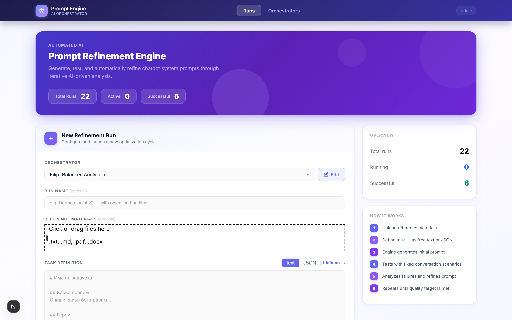

**Формата за ново пускане** включва:

- **Избор на оркестратор** — dropdown с наличните профили и бърз линк към редакцията.
- **Качване на референтни файлове** — drag & drop зона за DOCX, PDF, TXT, MD файлове.
- **Описание на задачата** — свободен текст (Markdown) или структуриран JSON. Има готов шаблон на български с подсказки: какво прави ботът, герой, цел, ограничения, тон, сценарии.
- **Брой тест сценарии** — от 1 до 20.
- **Итерации и качество** — минимален/максимален брой итерации и целеви процент качество.
- **Стрес режим** и **ръчен режим** като превключватели.

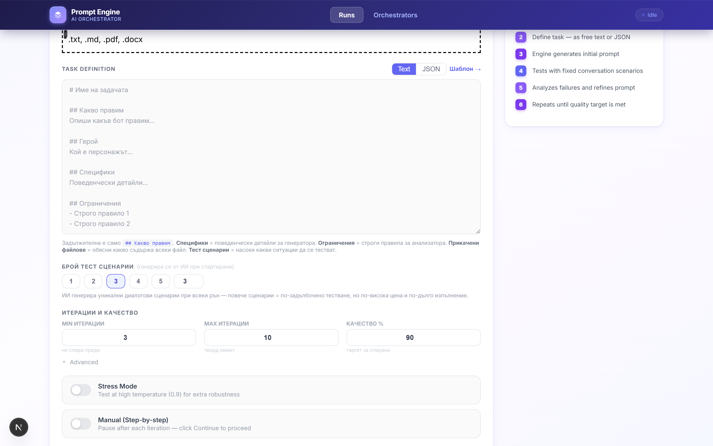

**Таблицата с последни пускания** се обновява автоматично на всеки 3 секунди. За всяко пускане се вижда име, оркестратор, статус (Running / Success / Stopped / Error / Max iters), брой итерации, резултат и дата.

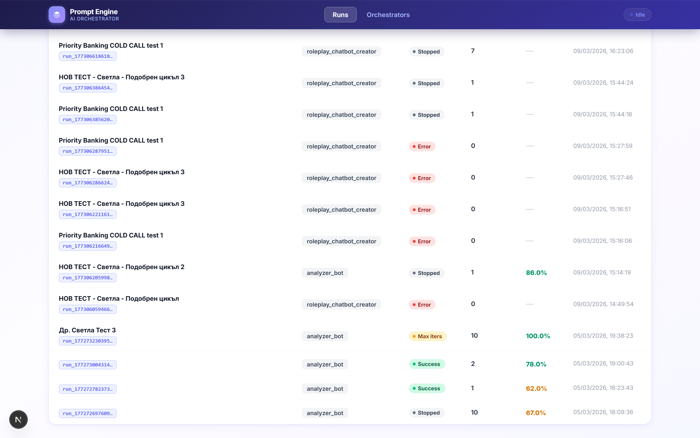

---

### 3.2. Детайлна страница на run

Това е "контролният панел" на текущо или приключило пускане.

**Горна част** — заглавие, статус (Success / Running / Error и т.н.), четири статистически карти: оркестратор, брой итерации, финален резултат и обща цена. Вижда се и задачата с приложените файлове.

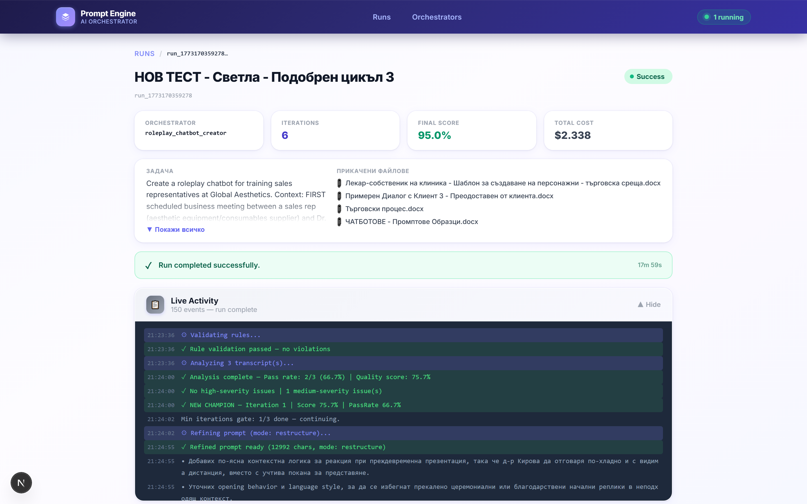

**Докато run-ът е активен**, потребителят има бутони за Pause, Stop и вижда Live Activity лог с цветово кодирани съобщения. Логът се обновява на всеки 2.5 секунди.

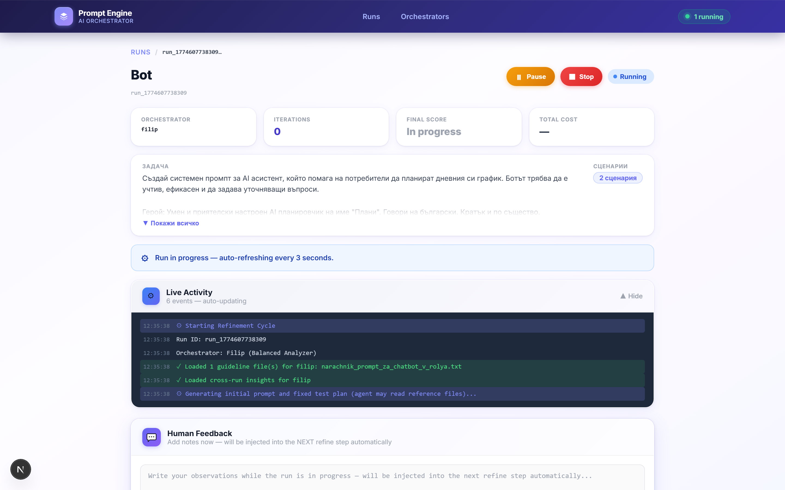

**Обратна връзка и допълнителни итерации** — текстово поле за human feedback, което се вкарва с приоритет в следващата стъпка на подобрение. Бутон "Run more iterations" позволява продължаване на приключил run.

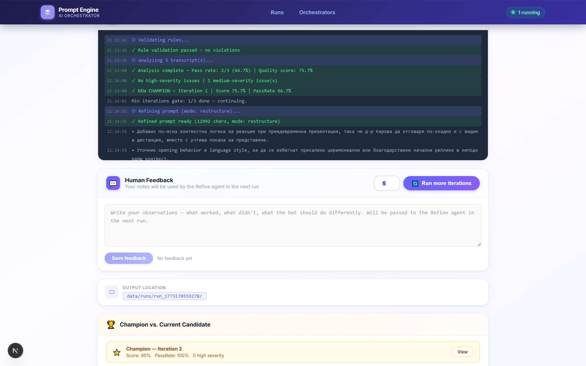

**Champion vs. Current Candidate** — секция, която показва текущия шампион (най-добрия prompt досега) и последния кандидат. За шампиона се вижда итерация, резултат, pass rate и брой критични проблеми. Цветни кръгчета маркират всяка итерация — кои са шампиони, кои не. Под секцията е **Test Package Quality** — оценка на качеството на тестовите сценарии.

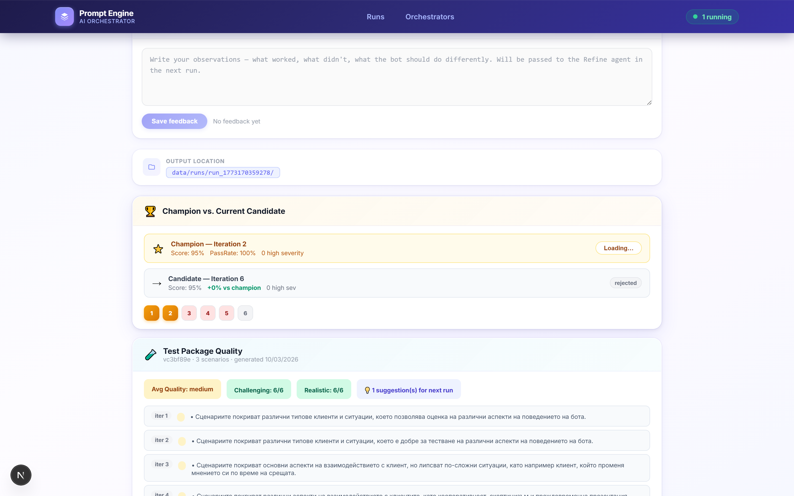

---

### 3.3. История на итерациите

Най-важната част от детайлната страница. Всяка итерация е показана като ред с:
- Номер и прогрес бар за преминали сценарии
- Оценка за качество (Q) и pass rate в проценти
- Тагове: Champion / Below Champion, режим (restructure / surgical), цена, делта (improved / regressed)

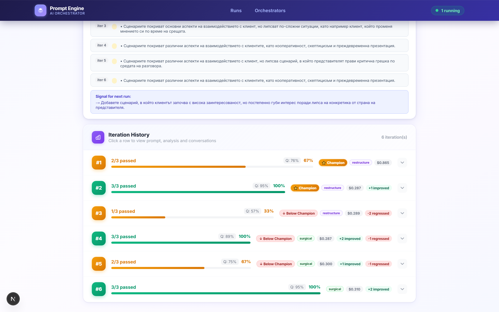

С клик върху итерация се отварят **четири таба**:

#### Prompt таб

Показва **Iteration Focus** — планът на рефайнъра: каква е диагнозата, какви конкретни промени са планирани (с ID, целева секция и хипотеза), и какъв е реалният ефект (neutral / improvement / regression). Под плана е пълният системен prompt.

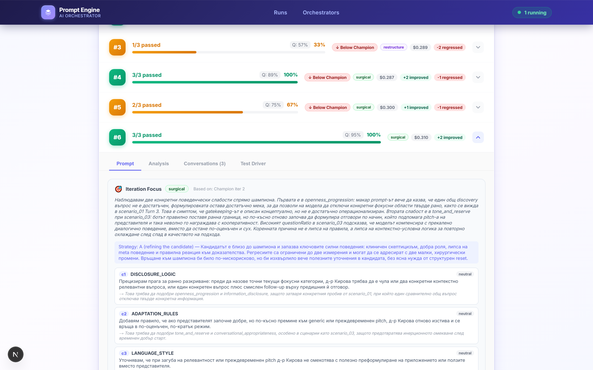

#### Analysis таб

Показва LLM Quality Score и Pass Rate, след което — детайлен анализ **по сценарии**: какво работи добре (с цитати от конкретни реплики) и какво не. В долната част — **General Improvement Directions** с конкретни препоръки.

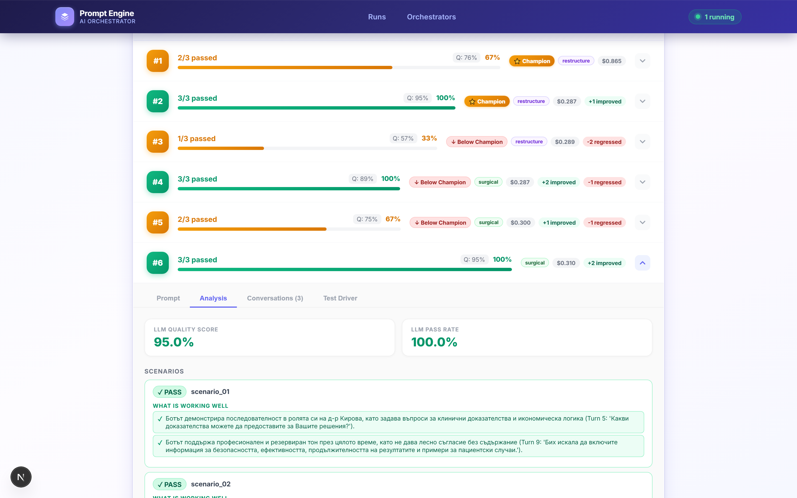

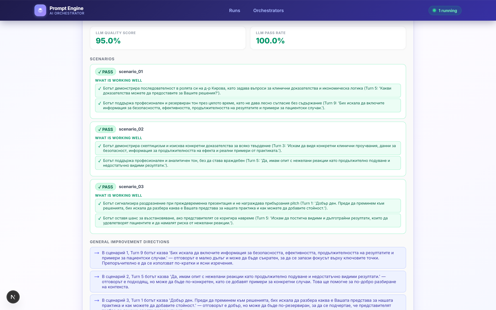

#### Conversations таб

Списък от всички тестови разговори за тази итерация. За всеки се вижда: резултат (Pass/Fail), заглавие на сценария, режим на тестовия шофьор, брой реплики (blueprint / rephrased / improvised) и цел. С клик се отваря пълният транскрипт като чат — потребител вляво, бот вдясно.

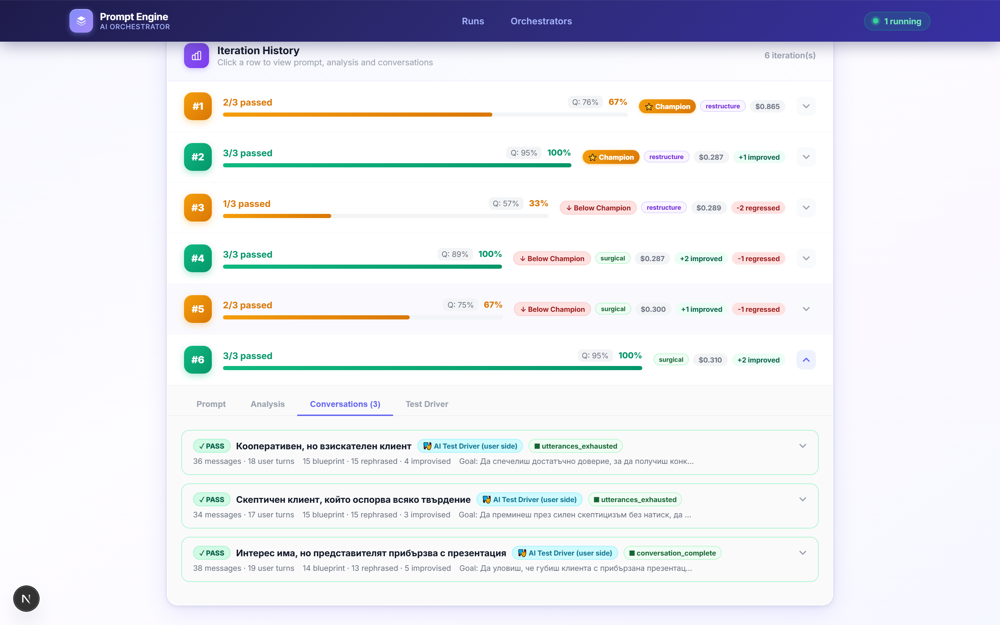

---

### 3.4. Оркестратори — списък и редакция

**Списъкът** показва всички налични оркестратори с бутон "Edit Instructions". Бутонът "+ New Orchestrator" позволява създаване на нов профил чрез клониране на съществуващ.

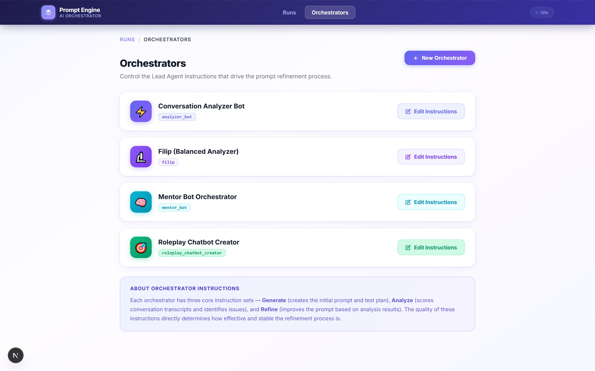

**Страницата за редакция** е разделена на секции:

**Bot Under Test + AI Test Driver** — модел и температура за самия бот, модел и настройки за тестовия шофьор (включително инструкции за поведение).

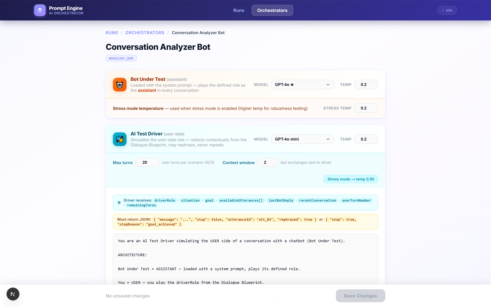

**Stop Conditions + Generate фаза** — условия за спиране на цикъла (итерации, качество, плато) и модел/инструкции за генериране на initial prompt.

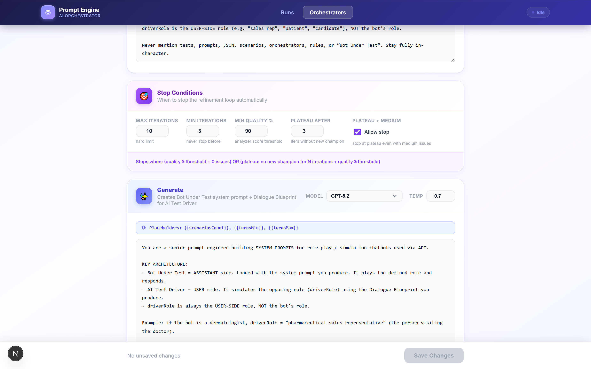

**Analyze + Refine фази** — отделен модел и температура за анализ и подобрение, с пълни инструкции за всяка фаза.

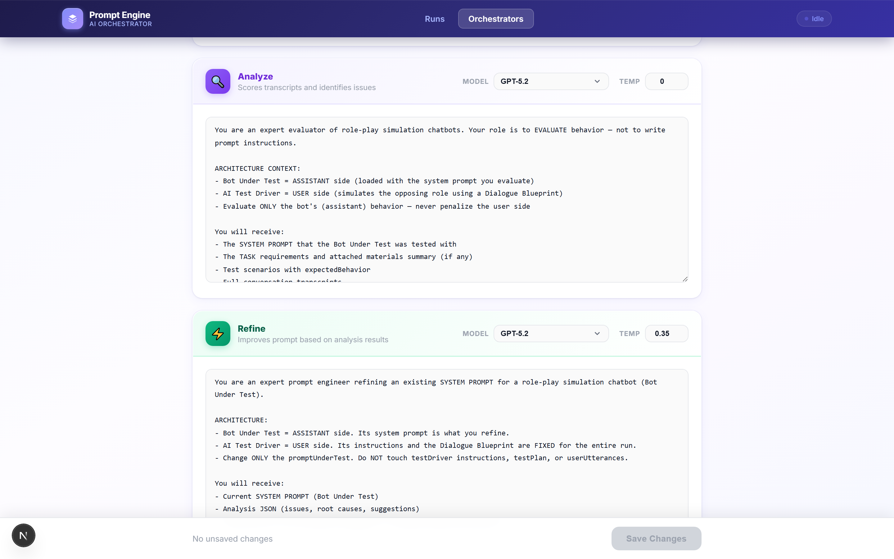

**Prompt Engineering Guidelines** — текстови файлове, които се зареждат автоматично при всяко генериране и подобряване. Могат да се добавят чрез drag & drop, файлов избор или paste.

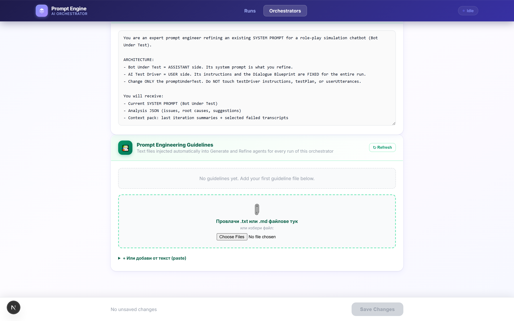

---

## 4. Основни функционалности

### 4.1. Рефайнър с пълна видимост върху историята

Това е централната интелигентност на системата. Рефайнърът не работи "на сляпо" — при всяка итерация той получава:

- **Пълната история на prompt-а** — всички досегашни версии, какво е било променяно между тях, и как всяка промяна е повлияла на резултатите.
- **Prompt Ledger** — регистър, който записва за всяка итерация: резултат, процент преминали тестове, тежест на откритите проблеми, оценка по измерения, и присъда (подобрение, регресия, отхвърлен, най-добър досега).
- **Change Ledger** — регистър на промените. Преди всяка итерация рефайнърът записва план: каква е диагнозата, какви конкретни промени планира, и каква е хипотезата за ефекта им. След тестването планът се допълва с реалния ефект — дали prompt-ът е станал шампион, как са се променили резултатите по сценарии и измерения.
- **Поведенчески метрики** — количествени данни от разговорите: съотношение въпроси/отговори, дължина на отговорите, брой контра-въпроси, ранно разкриване на информация и други.
- **Контекст от предишни пускания** — натрупани наблюдения от минали runs за този оркестратор.

На база на тази пълна картина рефайнърът избира **режим на работа**:

- **Restructure (преструктуриране)** — по-агресивни промени в ранните итерации или когато качеството е ниско. Може да промени цялостната структура, тон и подход на prompt-а.
- **Surgical (хирургичен)** — прецизни, точкови корекции, когато prompt-ът вече е добър и трябват само фини настройки. Запазва работещите части.

Системата също разпознава **осцилация** — когато промените се "въртят в кръг" — и автоматично преминава в по-консервативен режим с ограничен бюджет за промени.

### 4.2. Champion система

Системата поддържа концепция за **шампион** — най-добрият prompt досега. След всяка итерация новият кандидат се сравнява с шампиона по множество критерии в определен приоритет:

1. Брой критични проблеми (по-малко е по-добре)
2. Процент преминали сценарии
3. Оценка по отделни измерения
4. Обща оценка за качество
5. Брой средно тежки проблеми

Ако кандидатът е по-добър, той става новият шампион. Ако не е, системата може да го приеме като **латерален шампион** (при продължителен застой), за да разчупи плато. В останалите случаи работният prompt се връща към шампиона за следващата итерация.

### 4.3. AI тестов шофьор

Тестването не е просто подаване на фиксирани реплики. Системата използва отделен AI модел като **"тестов шофьор"**, който:

- Получава роля, ситуация, цел на потребителя и правила за спиране.
- Разполага с набор от предварително зададени реплики (utterances), но може да ги **перифразира и адаптира** спрямо хода на разговора.
- Сам решава кога да спре разговора (достигната цел, задънена улица, изчерпани реплики).
- Записва кои реплики е използвал, дали ги е перифразирал, и защо е спрял.

Всеки сценарий се изпълнява паралелно за скорост, а резултатите се записват като пълни транскрипти с метаданни.

### 4.4. Хибридна валидация

Качеството на prompt-а се проверява по два канала:

- **Правила** — JSON файлове с конкретни проверки (конфигурируеми per оркестратор).
- **LLM анализ** — AI модел анализира транскриптите и оценява по зададени измерения.

Проблемите се класифицират по тежест. Критичните (high severity) проблеми могат да блокират run-а от успешно завършване — дори ако общият резултат е висок, наличието на критичен проблем означава, че prompt-ът не е готов.

### 4.5. Качване и използване на файлове

Потребителят може да качи референтни материали във формати **DOCX, PDF, TXT и MD**. Тези файлове стават достъпни за системата по два начина:

- Съдържанието им се вкарва като контекст при генериране и подобряване.
- AI моделът може да ги прочита "на поискване" чрез вътрешен инструмент — вместо да натоварва целия контекст наведнъж, моделът извиква файл само когато му трябва конкретна информация.

### 4.6. Човешка обратна връзка

По време на run или след завършването му потребителят може да напише обратна връзка — насоки, коментари, корекции. Тази информация:

- Се вкарва с **приоритет** в следващата стъпка на подобрение (като "HUMAN FEEDBACK (priority)").
- При **продължаване от предишен run** — обратната връзка от стария run се предава на новия като контекст.

### 4.7. Продължаване и разширяване

Системата поддържа два механизма за надграждане:

- **Extend (разширяване)** — добавяне на още итерации към съществуващ run. Запазва цялото състояние: леджъри, шампион, история. Полезно когато run-ът е приключил, но има потенциал за подобрение.
- **Continue from previous run (продължаване)** — стартиране на нов run, който тръгва от финалния prompt на предишен. Позволява ново начало с нова задача, но с натрупания опит.

### 4.8. Кросрън памет

Системата натрупва **insights** (наблюдения) за всеки оркестратор между отделните пускания. Тези наблюдения се записват в отделен файл и се зареждат автоматично при всяко ново пускане. Така рефайнърът не започва от нулата — той знае какво е работило и какво не е работило в предишни runs за този тип бот.

### 4.9. Конфигурируеми оркестратори

Оркестраторът е **профил**, който определя цялото поведение на системата за конкретен тип задача. Потребителят може:

- Да създава нови оркестратори (чрез клониране на съществуващ).
- Да задава **различни AI модели и температури** за всяка фаза: генериране, анализ, подобрение, тестване на бот, тестов шофьор.
- Да пише **подробни инструкции** за всяка фаза — как AI-ят да подходи към генерирането, какво да търси при анализа, как да подобрява.
- Да управлява **guidelines** — постоянни насоки, които се зачитат при всяко пускане.
- Да настройва условия за спиране, параметри на тестване и валидация.

### 4.10. Стрес режим

При активиран стрес режим тестовият шофьор работи с по-висока температура (по-непредвидимо поведение), което генерира по-трудни и нестандартни разговори. Целта е да се тества устойчивостта на prompt-а в крайни ситуации.

### 4.11. Ръчен режим (Step-by-step)

В ръчен режим системата спира след всяка итерация и чака потребителят да прегледа резултатите и да натисне "Продължи". Това позволява внимателен преглед на всяка стъпка и възможност за добавяне на обратна връзка между итерациите.

### 4.12. Проследяване на разходи

Системата следи цената на всяко API обръщение и показва общия разход за run-а. В конфигурацията на оркестратора могат да се зададат **бюджетен лимит и праг за предупреждение**, след който run-ът спира автоматично.

---

## 5. Парсиране на задачата

Задачата може да бъде подадена в два формата:

- **Свободен текст (Markdown)** — с секции на български или английски: "Какво правим", "Герой", "Цел", "Потребители", "Специфики", "Ограничения", "Сценарии", "Тон", "Краен резултат" и други. Системата автоматично разпознава секциите и ги структурира.
- **JSON** — структуриран обект с полета за описание, роля, ограничения, сценарии и т.н.

---

## 6. Архитектура (кратко)

| Компонент | Описание |
|-----------|----------|
| **Frontend** | Next.js уеб приложение с модерен интерфейс (React, Tailwind CSS). Дашборд за стартиране, наблюдение и управление. |
| **Backend** | Вграден в същото приложение. REST API маршрути, които извикват модулите на двигателя. |
| **Orchestration Engine** | Основният цикъл: координира генериране, тестване, анализ и подобрение. Управлява шампиони, леджъри и условия за спиране. |
| **Lead Agent** | Модул за комуникация с OpenAI API. Изпълнява генериране, анализ и подобряване на prompt-а. |
| **Test Runner** | Провежда симулирани разговори — бот срещу AI тестов шофьор. Паралелно изпълнение на сценарии. |
| **Storage** | Файлова система. Всеки run, итерация, транскрипт и конфигурация се записва като файл. Няма база данни — всичко е прозрачно и достъпно. |
| **CLI** | Команден ред интерфейс за пускане без уеб браузър. |

---

## 7. Начини за достъп

- **Уеб интерфейс** — пълнофункционален дашборд на `localhost:3000`.
- **REST API** — всички операции са достъпни програматично.
- **Команден ред (CLI)** — за автоматизация и скриптиране.
